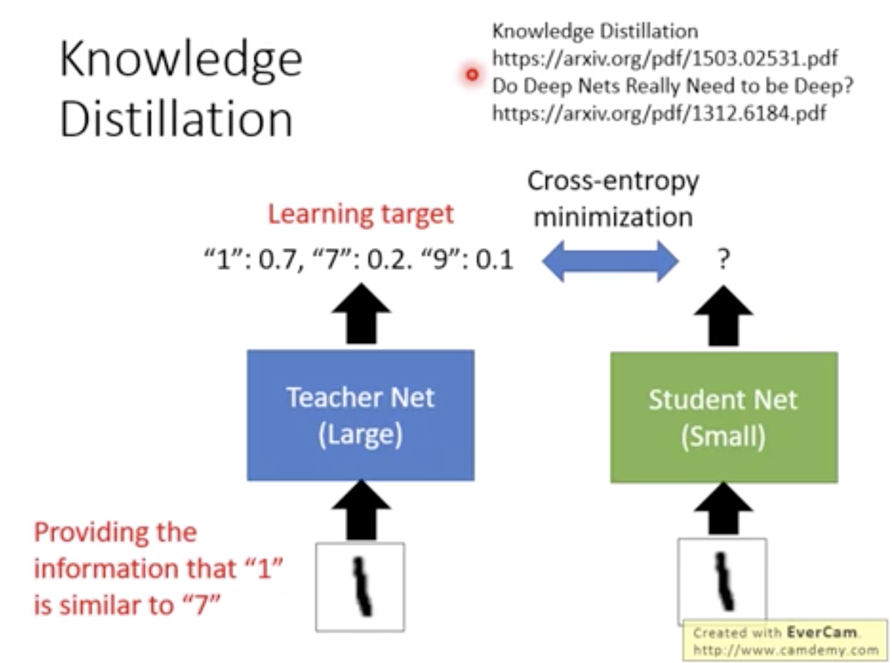
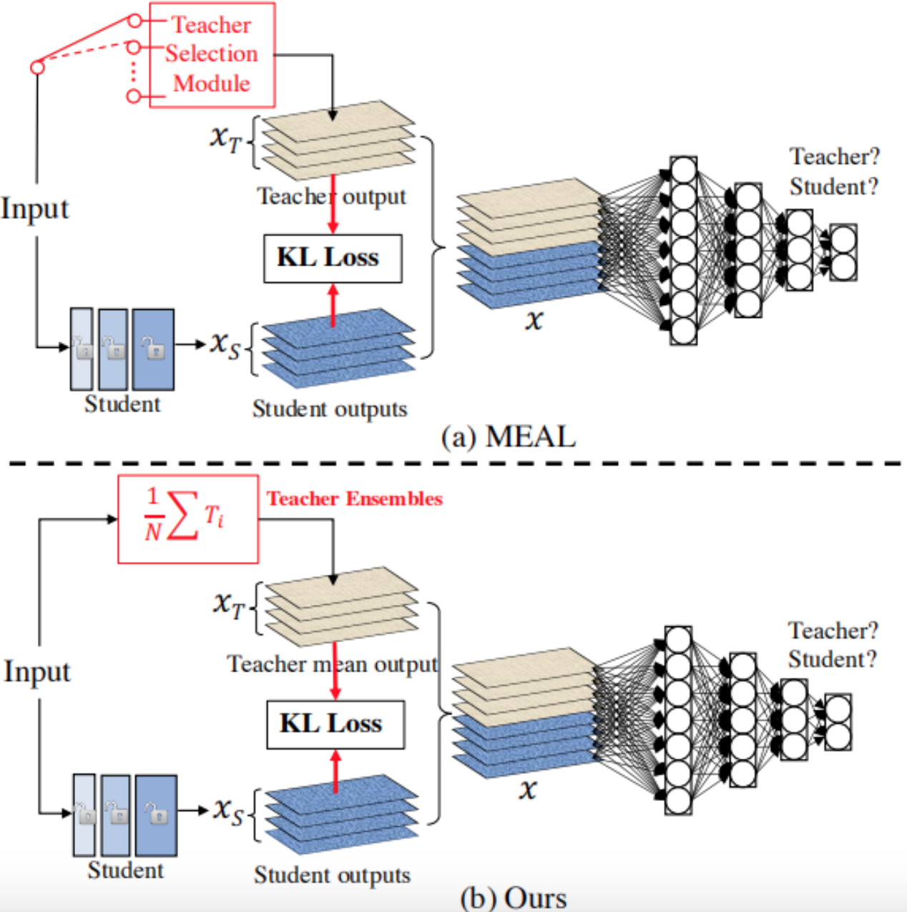

# Teacher-Student Ensemble Net
##### Part of the content refers to [this blog.](https://www.jianshu.com/p/5c38872cdc0f)
###### by Bo WU, 09-20-2020


---

## 1. Backstory
The deep learning models born in the academic field are incredibly powerful but seem too resource (inference time and memory) costly for industrial applications.

In 2015, Geoffrey Hinton brought the technique of knowledge distillation for model compression without losing performance too much. I recommend you to read his paper, "Distilling the Knowledge in a Neural Network", for the detail.

## 2. Teacher-Student Net
### 2.1 What is Teacher-Student Net
Teacher-Student Net consists of a large subnet or Teacher net and a small subnet or Student net. Teacher net is trained using the original training data while Student net is aimed to fit the outputs of Teacher net. Compared with a Student net if trained on original data, Student net trained to fit the outputs of Teacher net can be expected to be more powerful.

### 2.2 Why is Student Net Advanced?
Why Student net performs better than if it is trained without the guidance of Teacher net? One of the reasons is that the outputs of Teacher net, which are the targets of training Student net, are able to reveal more intrinsic information among categories for example so that Student net can learn from these information. An explanation is pasted as below.



### 2.3  The Steps of Conducting Knowledge Distillation.
There are three steps:
（1）Define a larger model as Teacher net, and a smaller model as Student net.
（2）Train Teacher net with training data.
（3）Replace the label with the outputs of Teacher net; Train Student net with these outputs as the targets by minimizing the KL divergence or cross entropy.

## 3. Python Demo
### 3.1 Vanilla Teacher Student Net
<span style="color:#B40431;background-color:#FBEFF2"> ☆☆☆ The basic Student Distillation Net is to train the (pre-trained) Student net with the outputs or predictions of Teacher net as its new targets. </span>

<span style="color:#B40431;background-color:#FBEFF2">
☆ Summary on MNIST data:

+ The validation acc of Teacher net is 98.28% with totally 61,514 parameters.
+ The validation acc of Student net is 92.30% with totally 50,890 parameters (or 10,624 parameters less).
+ The validation acc of Teacher Distillation net is 92.70% with totally the same number of parameters with Teacher net.
</span>

##### 3.1.1 Vanilla python code of Teacher Student net.
```Python
""" Vanilla Teacher Student Net
"""
from keras.datasets import mnist
from keras.layers import *
from keras import Model, utils
from sklearn.metrics import accuracy_score
import numpy as np


from numpy.random import seed
seed(1)
# from tensorflow import set_random_seed
# set_random_seed(2)


# >> Teacher net: 3-layer CNN model
def teacher_net():
    input_ = Input(shape=(28, 28, 1))
    x = Conv2D(32, (3, 3), padding="same")(input_)
    x = Activation("relu")(x)
    print(x)
    x = MaxPool2D((2, 2))(x)
    x = Conv2D(64, (3, 3), padding="same")(x)
    x = Activation("relu")(x)
    x = MaxPool2D((2, 2))(x)
    x = Conv2D(64, (3, 3), padding="same")(x)
    x = Activation("relu")(x)
    x = MaxPool2D((2, 2))(x)
    x = Flatten()(x)
    out = Dense(10, activation="softmax")(x)
    model = Model(inputs=input_, outputs=out)
    model.compile(loss="sparse_categorical_crossentropy",
                  optimizer="adam",
                  metrics=["accuracy"])
    model.summary()
    return model


# >> Student net: one 512 FC layer.
def student_net():
    input_ = Input(shape=(28, 28, 1))
    x = Flatten()(input_)
    x = Dense(64, activation="sigmoid")(x)  #512
    out = Dense(10, activation="softmax")(x)
    model = Model(inputs=input_, outputs=out)
    model.compile(loss="sparse_categorical_crossentropy",
                  optimizer="adam",
                  metrics=["accuracy"])
    model.summary()
    return model


def teacher_student_net(teacher_out, student_model, data_train, data_test, label_test):
    print('\nModel: Teacher-Student net')
    t_out = teacher_out

    s_model = student_model
    for l in s_model.layers:
        l.trainable = True

    label_test = utils.to_categorical(label_test)

    model = Model(s_model.input, s_model.output)
    model.compile(loss="categorical_crossentropy",
                  optimizer="adam")
    model.fit(data_train, t_out, batch_size=64, epochs=5)

    s_predict = np.argmax(model.predict(data_test), axis=1)
    s_label = np.argmax(label_test, axis=1)
    print('teacher-student net acc: ', accuracy_score(s_predict, s_label))


# >> Load data
(data_train, label_train), (data_test, label_test) = mnist.load_data()
data_train = np.expand_dims(data_train, axis=3)
data_test = np.expand_dims(data_test, axis=3)

# >> Teacher net
t_model = teacher_net()
t_model.fit(data_train, label_train, batch_size=64, epochs=2, validation_data=(data_test, label_test))

# >> Student net
s_model = student_net()
s_model.fit(data_train, label_train, batch_size=64, epochs=10, validation_data=(data_test, label_test))

# >> Teacher-Student net
t_out = t_model.predict(data_train)
# teacher_student_net(t_out, student_net(), data_train, data_test, label_test)
teacher_student_net(t_out, s_model, data_train, data_test, label_test)
```
##### 3.1.2 The detailed outputs of the program go below.
```bash
Model: "model_1"
_________________________________________________________________
Layer (type)                 Output Shape              Param #   
=================================================================
input_1 (InputLayer)         (None, 28, 28, 1)         0         
_________________________________________________________________
conv2d_1 (Conv2D)            (None, 28, 28, 32)        320       
_________________________________________________________________
activation_1 (Activation)    (None, 28, 28, 32)        0         
_________________________________________________________________
max_pooling2d_1 (MaxPooling2 (None, 14, 14, 32)        0         
_________________________________________________________________
conv2d_2 (Conv2D)            (None, 14, 14, 64)        18496     
_________________________________________________________________
activation_2 (Activation)    (None, 14, 14, 64)        0         
_________________________________________________________________
max_pooling2d_2 (MaxPooling2 (None, 7, 7, 64)          0         
_________________________________________________________________
conv2d_3 (Conv2D)            (None, 7, 7, 64)          36928     
_________________________________________________________________
activation_3 (Activation)    (None, 7, 7, 64)          0         
_________________________________________________________________
max_pooling2d_3 (MaxPooling2 (None, 3, 3, 64)          0         
_________________________________________________________________
flatten_1 (Flatten)          (None, 576)               0         
_________________________________________________________________
dense_1 (Dense)              (None, 10)                5770      
=================================================================
Total params: 61,514
Trainable params: 61,514
Non-trainable params: 0
_________________________________________________________________
Train on 60000 samples, validate on 10000 samples
Epoch 1/2
60000/60000 [==============================] - 14s 233us/step - loss: 0.3506 - accuracy: 0.9344 - val_loss: 0.0730 - val_accuracy: 0.9761
Epoch 2/2
60000/60000 [==============================] - 14s 227us/step - loss: 0.0694 - accuracy: 0.9791 - val_loss: 0.0540 - val_accuracy: **0.9828**

Model: "model_2"
_________________________________________________________________
Layer (type)                 Output Shape              Param #   
=================================================================
input_2 (InputLayer)         (None, 28, 28, 1)         0         
_________________________________________________________________
flatten_2 (Flatten)          (None, 784)               0         
_________________________________________________________________
dense_2 (Dense)              (None, 64)                50240     
_________________________________________________________________
dense_3 (Dense)              (None, 10)                650       
=================================================================
Total params: 50,890
Trainable params: 50,890
Non-trainable params: 0
_________________________________________________________________
Train on 60000 samples, validate on 10000 samples
Epoch 1/10
60000/60000 [==============================] - 2s 30us/step - loss: 0.6686 - accuracy: 0.8246 - val_loss: 0.4007 - val_accuracy: 0.8898
Epoch 2/10
60000/60000 [==============================] - 2s 29us/step - loss: 0.3724 - accuracy: 0.8936 - val_loss: 0.3426 - val_accuracy: 0.9030
Epoch 3/10
60000/60000 [==============================] - 2s 28us/step - loss: 0.3509 - accuracy: 0.8979 - val_loss: 0.3181 - val_accuracy: 0.9076
Epoch 4/10
60000/60000 [==============================] - 2s 28us/step - loss: 0.3182 - accuracy: 0.9064 - val_loss: 0.2902 - val_accuracy: 0.9176
Epoch 5/10
60000/60000 [==============================] - 2s 28us/step - loss: 0.3013 - accuracy: 0.9108 - val_loss: 0.2977 - val_accuracy: 0.9117
Epoch 6/10
60000/60000 [==============================] - 2s 27us/step - loss: 0.2992 - accuracy: 0.9100 - val_loss: 0.2880 - val_accuracy: 0.9107
Epoch 7/10
60000/60000 [==============================] - 2s 26us/step - loss: 0.2866 - accuracy: 0.9136 - val_loss: 0.2810 - val_accuracy: 0.9171
Epoch 8/10
60000/60000 [==============================] - 2s 25us/step - loss: 0.2783 - accuracy: 0.9165 - val_loss: 0.2620 - val_accuracy: **0.9230**
Epoch 9/10
60000/60000 [==============================] - 2s 26us/step - loss: 0.2615 - accuracy: 0.9210 - val_loss: 0.2759 - val_accuracy: 0.9187
Epoch 10/10
60000/60000 [==============================] - 2s 26us/step - loss: 0.2581 - accuracy: 0.9235 - val_loss: 0.2516 - val_accuracy: 0.9221

Model: Teacher-Student net
Epoch 1/5
60000/60000 [==============================] - 2s 26us/step - loss: 0.2918
Epoch 2/5
60000/60000 [==============================] - 1s 24us/step - loss: 0.2813
Epoch 3/5
60000/60000 [==============================] - 1s 25us/step - loss: 0.2813
Epoch 4/5
60000/60000 [==============================] - 1s 23us/step - loss: 0.2644
Epoch 5/5
60000/60000 [==============================] - 1s 23us/step - loss: 0.2629
teacher-student net acc:  **0.927**
```

### 3.2 Add Temperature and Lambda to Teacher-Student Net
I've made small changes from [ref](https://github.com/johnkorn/distillation). Please check the folder of `ref_distillation-master`.

I pasted the markdown file from the ref above.
```
Knowledge distillation experiments
How to run the code
Dependencies: Keras, Tensorflow, Numpy

Train teacher model:
python train.py --file data/matlab/emnist-letters.mat --model cnn

Train perceptron normally
python train.py --file data/matlab/emnist-letters.mat --model mlp

Train student network with knowledge distillation:
python train.py --file data/matlab/emnist-letters.mat --model student --teacher bin/cnn_64_128_1024_30model.h5

Results
EMNIST-letters dataset was used for experiments (26 classes of hand-written letters of english alphabet)

As a teacher network a simple cnn with 3378970 parameters (2 conv layers with 64 and 128 filters each, 1024 neurons on fully-connected layer) was trained for 26 epochs and was early stopped on plateau. Its validation accuracy was 94.4%

As a student network a 1-layer perceptron with 512 hidden units and 415258 total parameters was used (8 times smaller than teacher network). First it was trained alone for 50 epochs, val acc was 91.6%.

Knowledge distillation approach was used with different combinations of temperature and lambda parameters. Best performance was achieved with temp=10, lambda=0.5. Student network trained that way for 50 epochs got val acc of 92.2%.

So, the accuracy increase is less than 1% comparing to classicaly trained perceptron. But still we got some improvement. Actually all reports that people did, show similar results on different tasks: 1-2% quality increase. So we may say that reported results were reproduced on emnist-letters dataset.

Knowledge distillation parameters (temperature and lambda) must be tuned for each specific task. To get better accuracy gain additional similar techniques may be tested, e.g. deep mutual leraning or fitnets.
```

---


## Final Notes
<span style="color:#B40431;background-color:#FBEFF2"> ☆ 1. Knowledge Distillation can be used to reduce the size of deployed models. But most likely it will drop the performance regarding accuracy.</span>

<span style="color:#B40431;background-color:#FBEFF2"> ☆ 2. Knowledge Distillation and Transfer Learning have sort of similarities.</span>

<span style="color:#B40431;background-color:#FBEFF2"> ☆ 3. Try [this method](https://arxiv.org/abs/2009.08453). Picture below is from its paper. Authors also add a binary Discriminator to identify whether the features are from Teacher net or Student net. (~GAN) </span>

